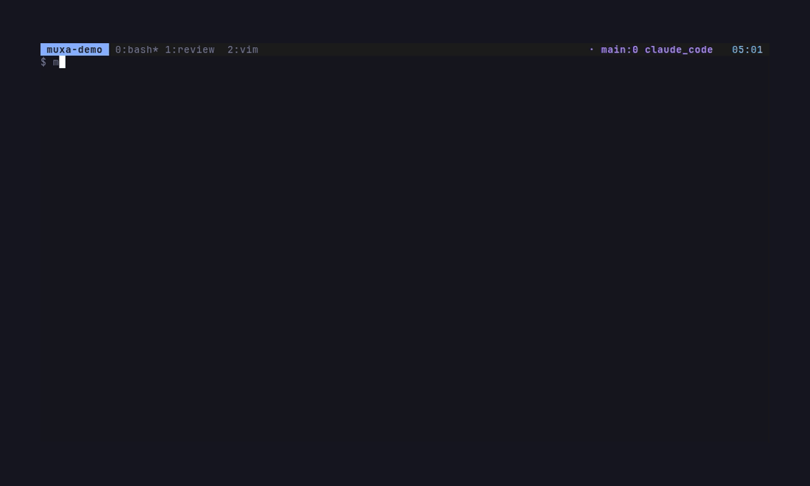
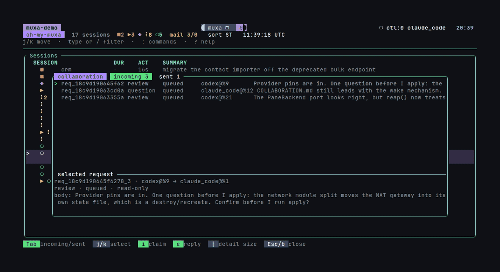
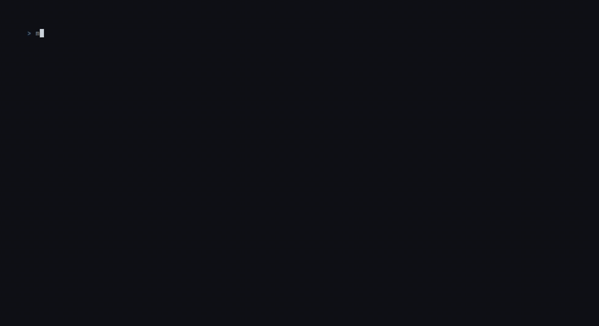

<div align="center">


**Work-oriented AI-agent observability & orchestration for tmux.**

See which agents are working, waiting, idle, or blocked from your tmux
status line, a live TUI, desktop notifications, and local reports.

[](https://github.com/Open330/muxa/actions/workflows/ci.yml)


**English** · [한국어](README.ko.md)

</div>

---

## Try Muxa onboarding before reading

Launch the complete fullscreen tour—no Muxa binary download or installation:

```bash
curl -fsSL https://raw.githubusercontent.com/Open330/muxa/main/scripts/onboard.sh | sh
```

<div align="center">
  
  <br />
  <sub><code>muxa watch</code> — the fleet, the inspector, the swarm view, and <code>muxa attend</code>.</sub>
</div>

`muxa` is a small daemon and CLI for observing — and now driving — AI
coding agents running inside terminal multiplexer panes. It reads agent
state from existing hook/event systems (Claude Code, OpenAI Codex, Google
Gemini CLI and its Antigravity successor), falls back to screen-manifest
detection for hook-less agents,
and correlates it all with multiplexer panes and sessions. Through `muxa
mcp` a coding agent can also orchestrate the others — inspect state, send
prompts, wait for changes.

It does not fork the multiplexer or modify agent binaries. tmux,
[rmux](https://rmux.io), and [herdr](https://herdr.dev) can be observed at the
same time; zellij has a CLI baseline. See the Hosts table below.

## Optimized for work-oriented tmux

Muxa treats tmux as a work execution adapter, not just a collection of terminal
panes. The durable logical model is Workspace → Work → Run → Agent session:

| tmux object | Muxa meaning | How it is used |
| --- | --- | --- |
| **session** | Workspace execution context | Contains active Run windows for one managed workspace. |
| **window** | One active Work Run | Carries a link to stable Work identity and cwd; closing it ends the Run. |
| **pane** | Agent execution surface | Binds an implementer, reviewer, or helper Agent session to that Run. |

The intended workflow is equally direct:

1. Start a work ID once; Muxa creates or reuses the workspace session, creates
   its work window, and starts the first agent pane.
2. Add implementer, reviewer, or helper agents as additional panes in that
   Work Run. Other Work items use sibling Run windows.
3. Observe, preview, message, and control those agents through `muxa watch`,
   or let an agent use the same policy through `muxa mcp`.
4. Close an agent pane, work window, or whole workspace session explicitly.
   Muxa refuses to terminate unmanaged tmux objects.

An optional Linear/GitHub/Jira issue is a reference attached to Work, not the
Work identity or local board stage. See [the Work domain model](docs/WORK_MODEL.md).
In short: **Workspace → Work → Run → Agent session**, with tmux as the current
binding. Run `muxa onboard` for one continuous safe scenario.
It welcomes you with the reason for creating a practice tmux session, then lets
you type `tmux new-session`, learn the hierarchy, windows, panes, detach/attach,
and managed prefix bindings before continuing directly into the Muxa watch workflow.
Nothing in the tour mutates a live tmux session.

> [!IMPORTANT]
> Beta. Event ingest, the daemon, CLI, live TUI, desktop notifications,
> stats, and reports work end-to-end, but APIs may still change before 1.0.

## What You Get

| Surface | What it does |
| --- | --- |
| `muxa status-line` | One-line tmux `status-right` summary for the active pane. |
| `muxa peek` | `prefix + q` overlay: each pane's live screen dimmed under a box with its agent's state, summary, and latest prompt/response — including how long ago you last prompted it and which pane was prompted most recently; press a digit to jump. |
| `muxa watch` | Main TUI for agents, prompts, live previews, and same-window collaboration. |
| `muxa dashboard` | Work-first TUI console; `P` prompts and `A` aborts every live agent in the selected Work. |
| `muxa attend` | Jump to the agent blocked on input/choice/error longest. |
| `muxa stats` / `muxa report` | Local analytics for prompt history, agent state duration, tmux foreground time, and human thinking time. |
| `muxa timeline` | Full-screen TUI timeline of agent work, waiting, errors, human interaction, and tmux foreground time. |
| `muxa activity` | Raw duration ledger query for debugging exactly what fed stats/report. |
| BarShelf widget (macOS) | Menu-bar popover summary of active, working, waiting, and error agents. |
| Dashboard | Optional loopback HTTP UI with SSE live updates and a timeline graph. |
| Notifications | Optional desktop alerts when agents need attention. |

## Install Muxa

If you decide to keep Muxa, install it with one of the following methods.

Requires tmux 3.x (or herdr) and a Unix-like OS.

Homebrew (pre-built binaries, no Rust toolchain needed):

```bash
brew install open330/tap/muxa
muxa init
```

Or the one-shot installer (builds from source, requires Rust 1.88+):

```bash
curl -fsSL https://raw.githubusercontent.com/Open330/muxa/main/scripts/install.sh | sh
```

Or from source:

```bash
git clone https://github.com/Open330/muxa.git
cd muxa
cargo install --path crates/muxad --locked
cargo install --path crates/muxa-cli --locked
muxa init
```

Verify:

```bash
muxad &
muxa status
muxa watch
```

### Collaborate from `muxa watch`

<div align="center">
  
  <br />
  <sub><code>b</code> mailbox · <code>m</code> message the row under the cursor · <code>a</code>/<code>A</code> headless ask.</sub>
</div>

The model is simple: **one tmux window is one room**. Interactive watch and
dashboard messages are sent by the operator console, so either popup can be
opened from an agent or a spare shell pane. Agent-initiated MCP and `muxa msg`
requests still use that agent's pane identity.

One-time setup: add the following to `~/.config/muxa/config.toml`, restart
`muxad`, and run `muxa init` to install the `prefix+s` watch popup.

```toml
[collaboration]
enabled = true
wake = "idle_only"
```

Register the MCP server once for both agent hosts, then restart agents that
were already running so they can read and reply to requests themselves.

```bash
claude mcp add --scope user muxa -- muxa mcp
codex mcp add muxa -- muxa mcp
```

Codex only forwards explicitly allowed environment variables to stdio MCP
servers. Add this line to the generated `[mcp_servers.muxa]` table in
`~/.codex/config.toml` (especially when using a custom muxa/tmux socket):

```toml
env_vars = ["RMUX", "RMUX_PANE", "TMUX", "TMUX_PANE", "MUXA_SOCKET"]
```

Muxa also recovers the pane from process ancestry across active pane backends
for existing default-endpoint Codex registrations, so older setups fail safely
rather than appearing paneless.

Connected agents are told that room peers can serve as read-only reviewers or
narrowly scoped execution subagents. Requests and replies can also carry
validated AIR 1.0 artifact references, which watch visualizes with
profile-colored mailbox badges.

You can call a colleague directly from a connected Claude or Codex
conversation. The agent maps the mention to Muxa's durable peer-call tool:

```text
@peer review the current changes
@codex /review-plan-feedback using commit abc123 as context
@peer's report: summarize it and apply only valid advice
```

`@peer` and `@muxa-peer` are reserved for Muxa collaboration. New requests use
the peer-call tool; references to an existing peer report use the durable
mailbox report tool and never imply a GitHub PR without an explicit PR reference.
`@peer` chooses a healthy same-window agent deterministically; `@claude`,
`@codex`, `@gemini`, `@alias`, and `role:name` narrow the target. Calls default
to `REVIEW · READ-ONLY`. Executing changes requires an explicit task
authorization, and creating a new agent pane requires a separate confirmation.
Restart an already-running agent after upgrading Muxa or changing registered
skills so its MCP process loads the new tool and templates.

Agents reported as synthetic by `muxa doctor` are omitted from collaboration
until a hook event establishes a stable session identity. Submit a prompt or
restart that agent, then check again.

Then:

1. Run two agents in two panes of the same tmux window.
2. Press `prefix+s` from any pane and select the recipient's session, window,
   or pane. Parent rows resolve to the lowest numeric live agent and show the
   exact target in the composer title.
3. Press `m`, type the request, and press `Enter`. At any point in the draft,
   `/` opens reusable skills registered with `muxa skill add`; selection inserts
   at the cursor and a second `Enter` sends. Press `M` to read and reply from
   the mailbox (`b` remains an alias).

For request/reply details, see
[docs/COLLABORATION.md](docs/COLLABORATION.md); for skill registration and
composer controls, see [docs/WATCH.md](docs/WATCH.md).

For install modes, `muxa init` presets, systemd, manual hook wiring, and
rollback details, see [docs/INSTALL.md](docs/INSTALL.md).

## Core Commands

Managed tmux policy binds a workspace context to a session, an active Work Run
to a window, and an Agent session to a pane. `muxa onboard` teaches tmux first and
introduces this Muxa mapping only after the tmux exercises, as one
continuous scenario. It starts at a blank virtual shell, accepts the real
`tmux new-session -s muxa-onboarding` and `tmux attach -t muxa-onboarding`
commands, and explains why each session command is needed before asking for it.
It preserves every virtual window/pane transition, then continues without
leaving fullscreen into the current `muxa watch` workflow. The watch half mirrors
the left-edge session-state gutter, columns, 50/50 inspector, overlays, and
footer. Commands and keys that you must enter are shown in bold yellow in both
the dialog body and footer. You advance with the real `j`, `l`, `Alt-T`, `o`,
`?`, `n`, `m`,
`Backspace`, `M`, and `q` actions. One 20-step counter covers the whole scenario:
managed prefix bindings are step 11 and work navigation follows as step 12.
Korean is selected automatically for a Korean locale, can be requested with
`--lang ko`, and can be toggled with `F2` during the tour.

<div align="center">
  
  <br />
  <sub><code>muxa onboard</code> — shell, tmux, and Muxa in one safe interactive scenario.</sub>
</div>

| Command | Purpose |
| --- | --- |
| `muxa status [--json]` | Human-readable table, or a versioned JSON snapshot for desktop integrations. |
| `muxa watch [--view pane\|work]` | Live workspace → work → agent TUI picker/dashboard. |
| `muxa dashboard [--since today]` | Work-card TUI with Run capture, per-agent and Work-wide prompt/abort actions, ACT/WACT totals, and collaboration controls. |
| `muxa attend [--cycle] [--list]` | Focus or list agents needing attention. |
| `muxa status-line [--pane %N]` | tmux status-line output. |
| `muxa peek [--plain]` | Per-pane overlay for the current tmux window; `--plain` prints it as text. |
| `muxa recap [--pane %N]` | Recent prompts from retained disk history. |
| `muxa peers` / `muxa identity` / `muxa msg` | Discover and name same-window agents, then exchange durable request/reply messages. |
| `muxa skill add/list/show/remove` | Manage reusable `/` prompt templates for watch/dashboard messages, watch ask, and MCP peer calls. |
| `muxa host add/list/label/annotate/doctor` | Manage physical SSH nodes and Kubernetes-style labels/annotations. |
| `muxa fleet status/watch/capture/send/attach` | Central host → session → window → pane(agent) observation and control. |
| `muxa stats --since today` | Focused WACT/ACT/WORK/WAIT summary; group by day/project/agent/session. Add `--graph` for graph-only WACT over time or `--verbose` for diagnostic columns. |
| `muxa report --since week` | All breakdowns (day/project/agent/session) as focused ACT/WACT tables; add `--json` or `--markdown` to export. |
| `muxa timeline --since today` | Interactive session-grouped timeline; filter with `--session main` / `--agent codex`, sort with `--sort waiting`, or use `--view heatmap`. |
| `muxa activity --type agent\|tmux\|human` | Raw activity ledger intervals. |
| `muxa sync` | Backfill the registry by scanning active pane hosts. |
| `muxa register --name X [--pid N]` | Surface an arbitrary background process (script, game, automation loop) as a pid-tracked row in `muxa status`. |
| `muxa run --detach --name X -- <cmd>` | Run a command in a muxa-owned PTY; it also appears in `muxa status` as a task. |
| `muxa work init` | Describe a work pipeline in your own words; an agent writes the `[ticket]`/`[[route]]`/`[pipeline.*]` config, validated and shown before anything is written. |
| `muxa work up cal-1234 --body "..."` | Resolve the ticket, route it to a workspace, and create whichever pipeline agent panes are missing — delivering the request to the ones already running. Re-running converges; also `muxa_start_work` over MCP. See [docs/PIPELINE.md](docs/PIPELINE.md). |
| `muxa work start muxa-onboarding --workspace muxa --agent codex ...` | Create/reuse workspace session `muxa`, create/reuse its work window, and add an agent pane. |
| `muxa workspace list/show/close` | Inspect or explicitly close workspace/project sessions. |
| `muxa work list/show/close [--workspace muxa]` | Inspect Work and its current Run binding, or explicitly close that Run window. |
| `muxa agent start --workspace muxa --work muxa-onboarding ...` | Add an allowlisted agent pane to one work window; also exposed as MCP `muxa_start_agent`. |
| `muxa agent control --pane %N --action interrupt` | Interrupt or explicitly terminate one managed agent pane. |
| `muxa onboard [--lang auto\|en\|ko]` | Unified shell → tmux → Muxa fullscreen walkthrough. `F2` switches language, `--no-quiz` skips gates, and `--print` emits the combined guide. |
| `muxa mcp` | MCP stdio server so a coding agent can orchestrate muxa — inspect agents, send prompts, capture panes, wait for changes (`claude mcp add --scope user muxa -- muxa mcp`, see [docs/MCP.md](docs/MCP.md)). |
| `muxa init` | Interactive install/uninstall wizard. |
| `muxad` | Daemon process. |

Common stats queries:

```bash
muxa stats --since today --group-by session
muxa stats --since yesterday --group-by project
muxa report --since last-week
muxa timeline --since today --session main
muxa timeline --since today --exclude-session 'monitor*'
muxa stats --since month --exclude-pane '%42' --exclude-session 'monitor*'
muxa timeline --since today --group-by kind --sort waiting
muxa timeline --view heatmap --since 12w
muxa timeline --day 2026-06-06
muxa activity --since today --type human
```

`--since` accepts `today`, `yesterday`, `week` for a rolling 7-day window,
`month` for a rolling 30-day window, `last-week` / `"last week"` for the
previous Monday-Sunday calendar week, `last-month` / `"last month"` for the
previous calendar month, rolling durations like `24h`/`7d`/`4w`, local dates
like `2026-06-06`, RFC3339 timestamps, and `all`. See
[docs/ACTIVITY.md](docs/ACTIVITY.md) for ledger semantics, including
`HUMAN`, `THINK`, and `ACT`.

`muxa stats`, `muxa report`, and `muxa timeline` also accept
`--exclude-pane` and `--exclude-session` for long-lived monitoring scopes.
Patterns are case-sensitive and support `*` and `?`, e.g.
`--exclude-session 'monitor*'`.

## Supported Agents

**Hook-based (authoritative).** These wire into their existing hook/event
systems, so muxa gets exact state transitions:

| Agent | Status | Config |
| --- | --- | --- |
| Claude Code | Supported | `~/.claude/settings.json` |
| OpenAI Codex | Supported | `~/.codex/config.toml` |
| Google Gemini CLI | Supported | `~/.gemini/settings.json` |
| Google Antigravity CLI (`agy`) | Supported | `~/.gemini/config/hooks.json` — [details](docs/ANTIGRAVITY.md) |
| opencode | Planned | [tracking issue](https://github.com/Open330/muxa/issues/14) |

**Screen-detected (fallback).** Agents with no hooks are classified from
their pane contents via TOML manifests — bundled for `agy`, `cursor-agent`,
`amp`, `copilot`, `aider`, and `goose`, extensible per user. Hooks win when
present, with one carve-out: `agy` fires no hook for an approval prompt, so its
panes stay screen-inferred for that one signal. See
[docs/SCREEN_DETECTION.md](docs/SCREEN_DETECTION.md).

On [herdr](https://herdr.dev) hosts, muxa additionally surfaces every
agent herdr's own detection sees, with no manifest needed.

## Fleet Hosts

Run muxad locally as a central controller for this machine and several
SSH-reachable machines. The controller appears immediately as the `local`
node, without Fleet configuration. Each physical node keeps its own stable UUID and label/annotation metadata;
the controller maintains one persistent outbound SSH stdio relay and an
independent last-known cache per node. `observe` is the default, while
`control` must be granted per host. No remote TCP listener is opened.

```bash
muxa fleet status                         # local is already present
muxa fleet status -L environment,region   # opt-in label columns
muxa fleet status -o wide                 # hostname/version/latency when space permits
muxa host label local environment=development
muxa host add dev muxa-devbox --label environment=development --mode observe
muxa host doctor dev
muxa fleet watch
# equivalent entry point: muxa watch --fleet
# `muxa init` also binds this view to tmux prefix+S (local watch stays prefix+s)
# with only local, this is the full native watch with no redundant host row
```

See [docs/FLEET.md](docs/FLEET.md) for selectors, TUI controls, security,
performance, MCP tools, and dashboard APIs.

## Pane Backends

muxa observes agents across terminal-multiplexer backends and can watch
several at once (e.g. during a tmux→herdr migration):

| Host | Status | Notes |
| --- | --- | --- |
| tmux | Full | The default backend. |
| [rmux](https://rmux.io) | Initial CLI backend | Pane discovery, capture, focus, and targeted input; see [docs/RMUX.md](docs/RMUX.md). |
| [herdr](https://herdr.dev) | Full | Via herdr's socket API; see [docs/HERDR.md](docs/HERDR.md). |
| zellij | CLI baseline | Richer plugin path planned; see [docs/ZELLIJ.md](docs/ZELLIJ.md). |

See [docs/MULTI_HOST.md](docs/MULTI_HOST.md) for observing multiple hosts
simultaneously.

## More Docs

| Topic | Doc |
| --- | --- |
| Install and wiring | [docs/INSTALL.md](docs/INSTALL.md) |
| Onboarding and work/agent policy (한국어) | [docs/ONBOARDING.ko.md](docs/ONBOARDING.ko.md) |
| Work pipelines (`muxa work up`) | [docs/PIPELINE.md](docs/PIPELINE.md) · [한국어](docs/PIPELINE.ko.md) |
| MCP control plane (`muxa mcp`) | [docs/MCP.md](docs/MCP.md) |
| herdr host support | [docs/HERDR.md](docs/HERDR.md) |
| rmux host support | [docs/RMUX.md](docs/RMUX.md) |
| Multi-host observation | [docs/MULTI_HOST.md](docs/MULTI_HOST.md) |
| Physical SSH fleet | [docs/FLEET.md](docs/FLEET.md) |
| Antigravity CLI (`agy`) support | [docs/ANTIGRAVITY.md](docs/ANTIGRAVITY.md) |
| Screen-manifest detection | [docs/SCREEN_DETECTION.md](docs/SCREEN_DETECTION.md) |
| Live TUI and prompt composer | [docs/WATCH.md](docs/WATCH.md) |
| CLI dashboard | [docs/DASHBOARD_CLI.md](docs/DASHBOARD_CLI.md) |
| Stats, reports, activity ledger | [docs/ACTIVITY.md](docs/ACTIVITY.md) |
| Timeline TUI and dashboard graph | [docs/TIMELINE.md](docs/TIMELINE.md) |
| Configuration reference | [docs/CONFIGURATION.md](docs/CONFIGURATION.md) |
| Web dashboard | [docs/DASHBOARD.md](docs/DASHBOARD.md) |
| External sinks | [docs/SINKS.md](docs/SINKS.md) |
| Zellij plan | [docs/ZELLIJ.md](docs/ZELLIJ.md) |
| Architecture and development | [docs/ARCHITECTURE.md](docs/ARCHITECTURE.md) |
| Agent collaboration | [docs/COLLABORATION.md](docs/COLLABORATION.md) |

## Development

```bash
cargo test --workspace
cargo clippy --workspace --all-targets -- -D warnings
cargo fmt --all -- --check
```

## License

MIT OR Apache-2.0.
